# SBOM Scanner - System Flowchart

## High-Level Overview

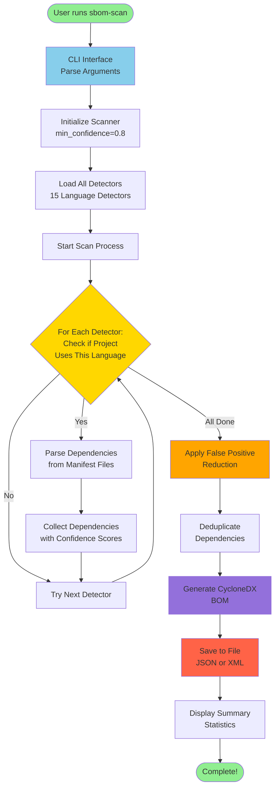

---

## Detailed System Flow

### 1. Command-Line Interface (CLI)

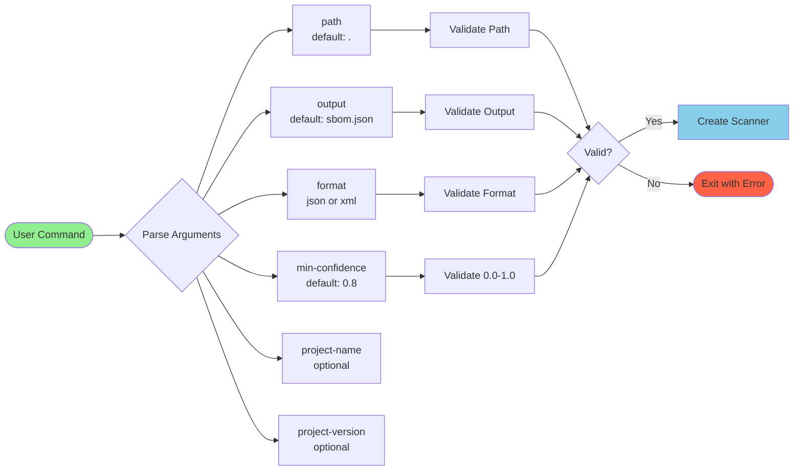

---

### 2. Scanner Initialization

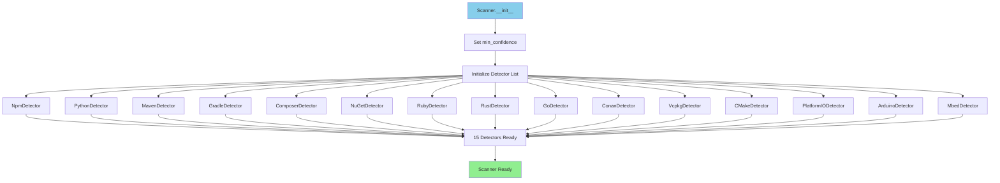

---

### 3. Scan Process

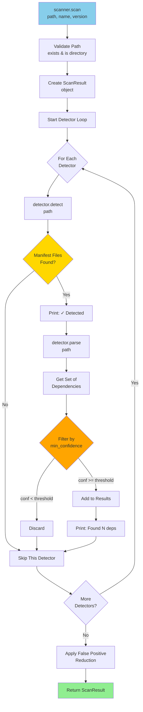

---

### 4. Detector Workflow (Base Pattern)

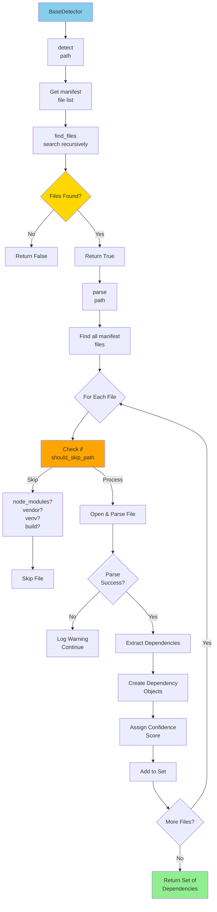

---

### 5. Example: NPM Detector Flow

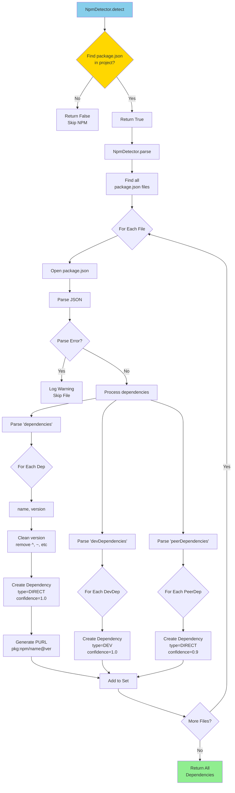

---

### 6. False Positive Reduction

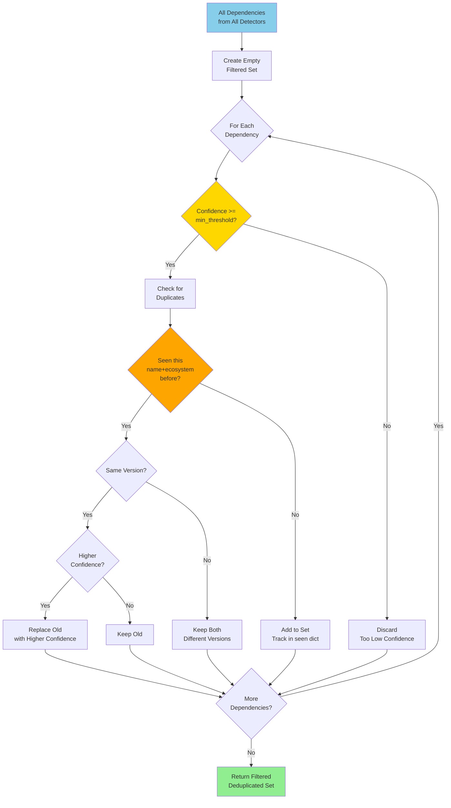

---

### 7. CycloneDX BOM Generation

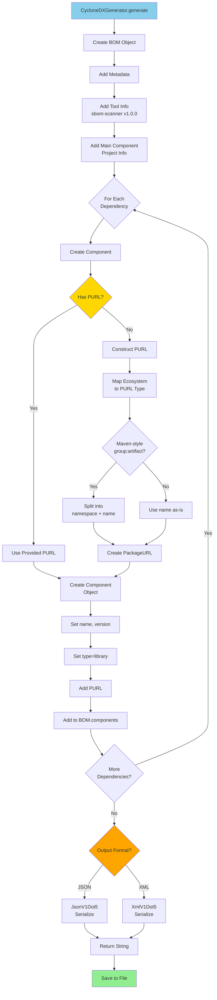

---

### 8. Complete End-to-End Flow

```
┌─────────────────────────────────────────────────────────────────┐
│                      USER INVOCATION                            │
│  $ sbom-scan /path/to/project -o sbom.json --min-confidence 0.8│
└─────────────────────────────────────────────────────────────────┘
                              │
                              ▼
┌─────────────────────────────────────────────────────────────────┐
│                      CLI LAYER (cli.py)                         │
├─────────────────────────────────────────────────────────────────┤
│  • Parse command-line arguments                                 │
│  • Validate inputs (path exists, confidence 0-1, format)        │
│  • Create Scanner instance                                      │
│  • Display banner and status messages                           │
└─────────────────────────────────────────────────────────────────┘
                              │
                              ▼
┌─────────────────────────────────────────────────────────────────┐
│                  SCANNER ORCHESTRATION (scanner.py)             │
├─────────────────────────────────────────────────────────────────┤
│  1. Initialize all 15 detectors                                 │
│  2. Create ScanResult object                                    │
│  3. For each detector:                                          │
│     ├─ detect() - check if language is present                 │
│     ├─ parse() - extract dependencies if detected              │
│     └─ filter by min_confidence                                │
│  4. Aggregate all dependencies                                  │
│  5. Apply false positive reduction                              │
│  6. Return ScanResult                                           │
└─────────────────────────────────────────────────────────────────┘
                              │
                              ▼
┌─────────────────────────────────────────────────────────────────┐
│              DETECTOR LAYER (detectors/*.py)                    │
├─────────────────────────────────────────────────────────────────┤
│  ┌───────────┐  ┌───────────┐  ┌───────────┐  ┌───────────┐  │
│  │    NPM    │  │  Python   │  │   Maven   │  │  Gradle   │  │
│  └───────────┘  └───────────┘  └───────────┘  └───────────┘  │
│  ┌───────────┐  ┌───────────┐  ┌───────────┐  ┌───────────┐  │
│  │ Composer  │  │   NuGet   │  │   Ruby    │  │   Rust    │  │
│  └───────────┘  └───────────┘  └───────────┘  └───────────┘  │
│  ┌───────────┐  ┌───────────┐  ┌───────────┐  ┌───────────┐  │
│  │    Go     │  │   Conan   │  │  vcpkg    │  │   CMake   │  │
│  └───────────┘  └───────────┘  └───────────┘  └───────────┘  │
│  ┌───────────┐  ┌───────────┐  ┌───────────┐                 │
│  │PlatformIO │  │  Arduino  │  │   Mbed    │                 │
│  └───────────┘  └───────────┘  └───────────┘                 │
│                                                                 │
│  Each detector:                                                 │
│  • Searches for manifest files (package.json, requirements.txt)│
│  • Parses dependencies with versions                            │
│  • Assigns confidence scores                                    │
│  • Returns Set[Dependency]                                      │
└─────────────────────────────────────────────────────────────────┘
                              │
                              ▼
┌─────────────────────────────────────────────────────────────────┐
│            DATA MODELS (models.py)                              │
├─────────────────────────────────────────────────────────────────┤
│  Dependency:                                                    │
│    • name: str                                                  │
│    • version: str                                               │
│    • ecosystem: Ecosystem (npm, pypi, maven, conan, etc.)      │
│    • purl: str (pkg:npm/express@4.18.2)                        │
│    • dependency_type: DIRECT | DEV | TRANSITIVE                │
│    • confidence: float (0.0-1.0)                                │
│    • source_file: str (package.json)                            │
│                                                                 │
│  ScanResult:                                                    │
│    • project_name: str                                          │
│    • project_version: str                                       │
│    • dependencies: Set[Dependency]                              │
│    • errors: List[str]                                          │
└─────────────────────────────────────────────────────────────────┘
                              │
                              ▼
┌─────────────────────────────────────────────────────────────────┐
│         FALSE POSITIVE REDUCTION (scanner.py)                   │
├─────────────────────────────────────────────────────────────────┤
│  1. Filter by confidence threshold (>= min_confidence)          │
│  2. Deduplicate by name + ecosystem                             │
│  3. Keep highest confidence for duplicates                      │
│  4. Remove obvious false positives                              │
│  5. Normalize versions (remove ^, ~, >=, etc.)                  │
└─────────────────────────────────────────────────────────────────┘
                              │
                              ▼
┌─────────────────────────────────────────────────────────────────┐
│       CYCLONEDX GENERATION (cyclonedx_generator.py)             │
├─────────────────────────────────────────────────────────────────┤
│  1. Create CycloneDX BOM object                                 │
│  2. Add metadata (tool, project component)                      │
│  3. For each dependency:                                        │
│     ├─ Create Component object                                 │
│     ├─ Generate/use Package URL (PURL)                         │
│     ├─ Set component type (library)                            │
│     └─ Add to BOM.components                                   │
│  4. Serialize to JSON or XML (CycloneDX v1.5)                   │
│  5. Save to file                                                │
└─────────────────────────────────────────────────────────────────┘
                              │
                              ▼
┌─────────────────────────────────────────────────────────────────┐
│                      OUTPUT                                     │
│  {                                                              │
│    "bomFormat": "CycloneDX",                                    │
│    "specVersion": "1.5",                                        │
│    "components": [                                              │
│      {                                                          │
│        "type": "library",                                       │
│        "name": "express",                                       │
│        "version": "4.18.2",                                     │
│        "purl": "pkg:npm/express@4.18.2"                         │
│      },                                                         │
│      ...                                                        │
│    ]                                                            │
│  }                                                              │
└─────────────────────────────────────────────────────────────────┘
                              │
                              ▼
┌─────────────────────────────────────────────────────────────────┐
│                   DISPLAY SUMMARY (cli.py)                      │
├─────────────────────────────────────────────────────────────────┤
│  ✓ Scan Summary                                                 │
│    Project Name:        my-project                              │
│    Total Dependencies:  25                                      │
│                                                                 │
│    Dependencies by Ecosystem:                                   │
│      npm           : 10                                         │
│      pypi          : 8                                          │
│      maven         : 5                                          │
│      conan         : 2                                          │
│                                                                 │
│    Output: sbom.json                                            │
│  ✓ Scan completed successfully!                                 │
└─────────────────────────────────────────────────────────────────┘
```

---

## Decision Flow: Confidence Scoring

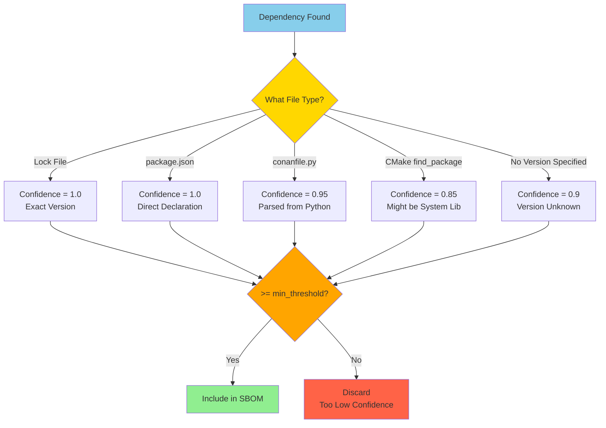

---

## File Processing Flow

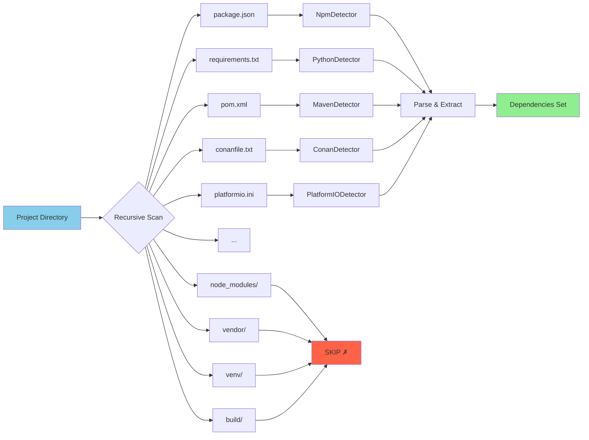

---

## Error Handling Flow

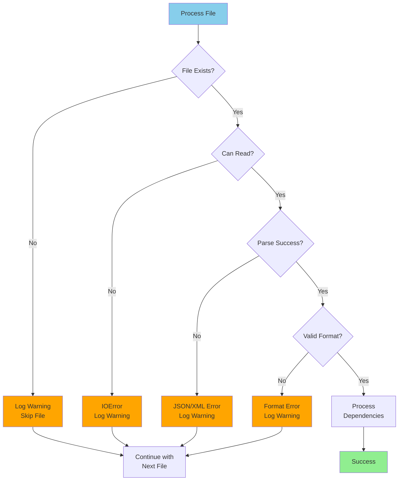

---

## Performance Optimization Flow

```mermaid
flowchart TB
    A[Scan Request] --> B[Early Detection]
    B --> C{Manifest Files<br/>Present?}
    C -->|No| D[Skip Detector<br/>Immediately]
    C -->|Yes| E[Proceed with<br/>Parsing]
    
    E --> F[Path Filtering]
    F --> G{In Skip List?<br/>node_modules<br/>vendor, etc.}
    G -->|Yes| H[Skip Directory<br/>No Recursion]
    G -->|No| I[Process Files]
    
    I --> J[Set-Based Storage]
    J --> K[O(1) Duplicate<br/>Detection]
    K --> L[Efficient<br/>Deduplication]
    
    D --> M[Fast Completion]
    H --> M
    L --> M
    
    style A fill:#87CEEB
    style C fill:#FFD700
    style G fill:#FFA500
    style M fill:#90EE90
```

---

## Summary: Three-Phase Architecture

```
┌───────────────────────────────────────────────────────────┐
│                    PHASE 1: DETECTION                     │
│  • Load all 15 detectors                                  │
│  • For each detector, check if language is present        │
│  • Quick detection using manifest file existence          │
│  • Skip detectors that don't apply                        │
└───────────────────────────────────────────────────────────┘
                          │
                          ▼
┌───────────────────────────────────────────────────────────┐
│                    PHASE 2: PARSING                       │
│  • For detected languages, parse manifest files           │
│  • Extract dependency name, version, type                 │
│  • Assign confidence scores                               │
│  • Generate Package URLs (PURL)                           │
│  • Collect all dependencies in a set                      │
└───────────────────────────────────────────────────────────┘
                          │
                          ▼
┌───────────────────────────────────────────────────────────┐
│               PHASE 3: GENERATION                         │
│  • Filter by confidence threshold                         │
│  • Deduplicate dependencies                               │
│  • Generate CycloneDX BOM (JSON/XML)                      │
│  • Save to file                                           │
│  • Display summary statistics                             │
└───────────────────────────────────────────────────────────┘
```

---

**This flowchart documentation provides a complete visual understanding of the SBOM Scanner's architecture and operation!** 🎨

